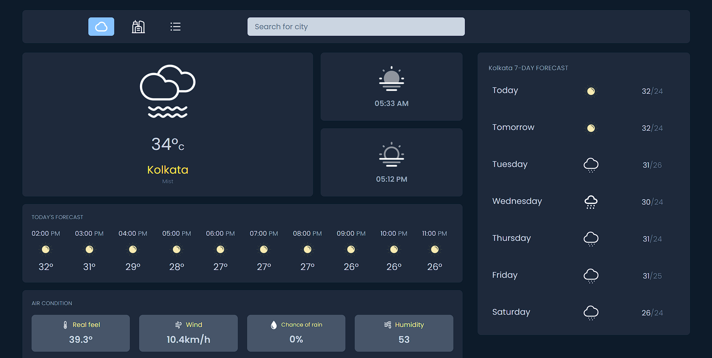

# Weather App

A simple and responsive weather application built with React.js and WeatherAPI to show real-time weather information based on city names. This project allows users to search for weather data by city and displays current weather conditions, including temperature, humidity, and weather description.

## Features

- **Search for Cities:** Enter any city name to get real-time weather information.
- **Real-time Weather Updates:** Displays up-to-date weather conditions including temperature, humidity, and wind speed.
- **User Notifications:** Get notifications for invalid city searches or errors using `react-toastify`.
- **Responsive Design:** Works well on both desktop and mobile devices.

## Built With

- **[React.js](https://react.dev/)**: JavaScript library for building user interfaces.
- **[WeatherAPI](https://www.weatherapi.com/)**: Used to fetch real-time weather data.
- **[Axios](https://www.npmjs.com/package/axios)**: For making API requests.
- **[React Router](https://reactrouter.com/en/main)**: For routing and navigation.
- **[React Toastify](https://www.npmjs.com/package/react-toastify)**: For toast notifications.
- **[Dotenv](https://www.npmjs.com/package/dotenv)**: For managing API keys securely.

## Prerequisites

Make sure you have the following installed:

- Node.js (v14+)
- npm (v6+)

## Getting Started

1. Clone the repository:

   ```bash
   git clone https://github.com/KousikBhowmik/Weather-app-react.git
   cd weather-app
   ```
2. Install the dependencies:
    ```bash
    npm install
    ```
3. Create a `.env` file in the root directory and add your WeatherAPI key:
    ```bash
    npm i dotenv
    # inside env file
    vite_api_key = your_api_key_here
    # dont forgot to use "vite_" in prefix
    ```
4. Run the application:
    ```bash
    npm run dev
    ```
5.  Open your browser and go to `http://localhost:"provided port number"` to view the app

## Live preview

<a href="https://weather-app-react-tau-ashy.vercel.app" target="_blank"></a>
